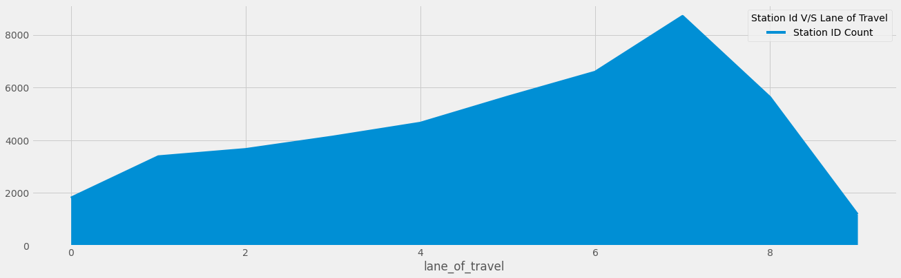

# DATA AND AI TRACK SUBMISSION

This project is my Submission for HACK-IT challenge by OCBC in DATA and AI Track.

# GETTING STARTED

- Clone this repository: `https://github.com/SatYu26/OCBC-Submission-Data_and_AI_Track.git`
- cd into the folder: `cd OCBC-Submission-Data_and_AI_Track`
- Open the project in Jupyter Notebook using command `jupyter notebook`
- You can also open the project by opening the `OCBC_Submission_Satyam_Goyal.ipynb` file in Google Colab. Visit  and upload the ipynb file to open it in Colab.
- After opening the project change the location of <a href="https://www.kaggle.com/jboysen/us-traffic-2015">Traffic Dataset</a> in code cell/block 2 according to the location of dataset in your device.
- Run each code block and see the results.

# OUTPUT

## Pattern 1:

On the basis of below bar plot between **Traffic count and Days of weeks** across all time frames we can conclude that:

- The **maximum amout of Traffic occurs on Day 6 i.e saturday around the hours of 12 to 16 i.e. Afternoon Hours**.
- Also the traffic on other days is almost similar and the **minimum amount of traffic occurs during eary morning hours between 1 to 4**.

 

 

## Pattern 2:

In the below Bar plot we have created the Graph between **Direction of travel and The traffic count** on Diferrent days across all time Frames.

1. With this we can Easily conclude that **Northeast-Southwest Direction have the maximum amount of traffic** specially on Hours 1 to 4, 4 to 8 i.e. **early mornings and at Late nights between hours 20 to 24**.

2. We can also conclude that The **traffic on time range 8 to 12 is extremely less** irrespective of Direction of travel.

 

 

We can also conclude on the basis of the below density graph that **highest density of traffic is in Direction number 1 and 5 i.e. North and South across all the times included**.

 

 

Using the below Graph we can further Solidify our above theory that the **maximum amount of traffic occurs in the Direction of Northeast-Southwest and in time range of 13 to 16 and 17 to 20**.

 

 

## Pattern 3:

In the below Graph we have created the Graph between **Lane of travel and The traffic count** on Diferrent days across all time frames.

1. With this we can Easily conclude that **Lane number 8 have the maximum amount of traffic** specially on Hours 1 to 4 and 4 to 8 i.e **Early Mornings, and the Least amount of traffic on Lane number 1**.

2. We can also observe that on the **time range of 8 to 12 the traffic is very least irrespective of Lane number**.

 

 

With the below mentioned **Area graph between Station ID and Lane of Travel** We can conclude that:

- The Reason for **Maximum Traffic on the Lane number 7 and Lane number 8** was because **There are more number of stationed located on that path** and because of that people Travel more across those lanes.

 

 

## Pattern 4:

In the below Graph we have created the Graph between **Functional Classification and The traffic count** on Diferrent days across all time frames.

1. With this we can Easily conclude that **Urban Principal Arterial: Interstate and Other Expressways have the maximum amount of traffic** specially on Hours 1 to 4 and 4 to 8 i.e **Early Mornings and Late night between hours 20 to 24, also the Least amount of traffic on Lane number 1**.

2. We can also observe that on the **time range of 8 to 12 the traffic is very least irrespective of Functional Classification and on the Rural Local system we have the least Traffic**.

 

 

## Pattern 5:

From the below mentioned Bar Graph between **Functional Classification and Lane numbers** we can Conclude that:

- Most number of people from **Rural Areas travel mostly on Outer Lanes (i.e. 5, 6, 7, 8, 9) instead of main Lanes**.

- Infact we can clearly see that **There are almost negligible people from Urban Areas travelling in outer lanes except of lane 8 as there as most number of stationes situated in that lane**.

 

 

We can further solidify our above mentioned argument that **Most amount traffic occurs in Urban: Principal Arterial - Interstate Area in hours 13 to 16 and 17 to 20 i.e. in Evening time mostly**.

 

 

## Model Result:

- Our **Random Forest Regressor** model Performed very nicely with the **accuracy of 95.25%**.

## Explain why you chose this particular model for solving the problem?

- The reason we chose this particular model for solving the problem was because of the accuracy and depth this model provides to my output.

- The reason for choosing Lane of Travel as output of my model was because during Data Analysis phase, we observed a pattern in which most of the data had a similarity and good relation with Lane of Travel column and therefore it will provide us with high accuracy and consistency throughout the model.

# FULL PROJECT

To look at the full project with Dataset and Output Model Visit this Google Drive link <a href='https://drive.google.com/drive/folders/1y_oMFMr1wG6oIp2IqdmCKDSsP3ZDD0Fh?usp=sharing'>HERE</a>.
